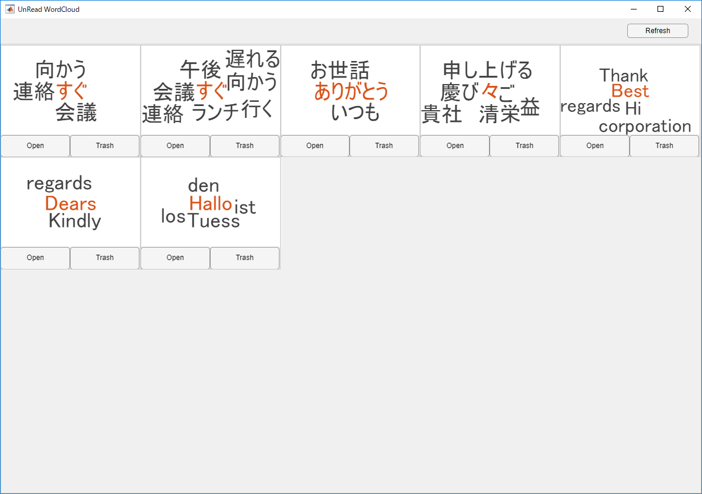

# UnreadWordCloud
A sample program of AppDesigner and ActiveXServer of MATLAB.

Get unread mails from inbox of Microsoft(R) Outlook(R) via ActiveXServer and show them on tiles as word cloud images.

Copyright 2019-2020 The MathWorks, Inc.

This submission was developed by Yoshio Watanabe from MathWorks Consulting Services (https://mathworks.com/services/consulting).

